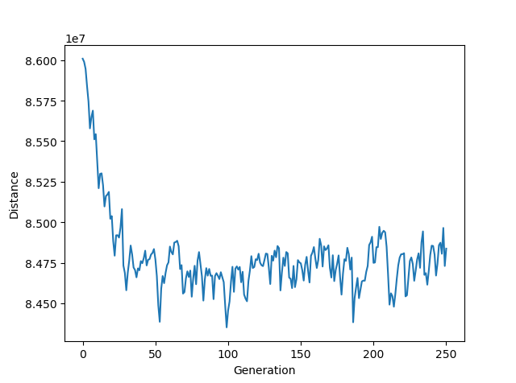

# Genetic-TSP-solver
#### This project is aims to solve Traveling Salesman Problem with genetic algorithm. The source data is downloaded from [TSPLIB](http://elib.zib.de/pub/mp-testdata/tsp/tsplib/tsplib.html)
---
# Brief concept
  In order to solve TSP with genetic algorithm, I defined the city as **gene**. And each
single route(the path through the cities) is **chromosome**. First, generates the population
which is collection of the routes. Then, calculate the **fitness** of each routes. In this
algorithm, fitness function is inverse of the distance. If total distance decreases, then
fitness score will be increased. After the fitness calculation is done, sorts the routes with
fitness. Some of the top chromosome group is called **elite**. We will generate **mating
pool** with elites which is source population of the next generation. This strategy makes
next generation’s fitness better. When we generate the next generation, do the **ordered
crossover** operation(in other words, we will call this breeding) on the mating pool and
generate **children**. And do the **mutate** operation on the children population which swap
two cities in the route with small probability. The algorithm repeats this process.

---
# Directory Structure
```
.
|--tsp
|   |--code
|   |    |--ga.py
|   |    |--main.py
|   |    |--tsp_parser.py     
|   |    |--requirements.txt
|   |--data
|        |--rl11849.tsp
|--README.md
```
---
# Project setup
python 3.6.5 is used 

From the /tsp/code directory
```
> pip install -r requirements.txt
```
---
# Usage
This project provides way to control the model parameter with arguments. Usable flags are given below.
- **-h, -help** Show usuage of the program
- **-p P** Population size
- **-f F** Total number of fitness evaluations
- **-e E** The size of the elite population
- **-m M** Probability of the mutation
- **-plot (n,y)** Plot the distance-generation graph (y)es/(n)o
This is the example usage of the program
```
> python main.py rl11849.tsp -p 100 -f 200 -plot y
```
---
# Result
With population size = 200, elite size = 50, mutation rate = 0.01, total generation =
250, I got 84,837,226.06 for the final distance.


